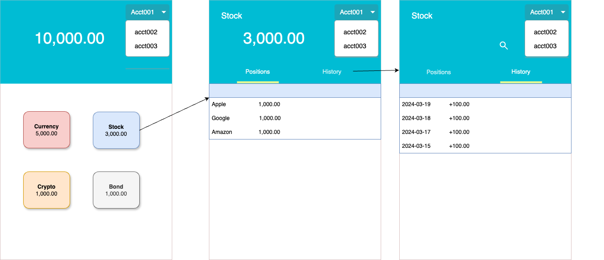

Ledger
===

in case of you haven't install readme addon, your can read `pdf` version of `README`
> [./doc/README.md.pdf](./doc/README.md.pdf)

# Requirements

>[Original Requirements](./doc/Coding%20Assignment.pdf)

- Assuming authentication and authorization are provided, the current microservice does not take them into consideration.  
- Assuming this is a new application, so do not consider any other legacy data.  
- Assuming only support US dollar currency, all of assets amount is US currency.  
- Assuming asset amount not consider changes.  
- Assuming app is able to move to another owner's account wallet and it can not move from different types of wallets (e.g. can not move stock wallet asset to currency wallet).
- Assuming there has a special system account "A00000000" support negative number, handle cross third party system incoming and outgoing movement.  
    for example, a customer account "ABCDE001" received 100.00 dollar transfer from Paypal.  the data looks like following:  
    <pre>
    account A00000000  
        currency wallet asset amount += -100.00
    account ABCDE001 
        currency wallet asset amount += 100.00
    </pre>

**Questions**  

**Non-functional**  
- high-availability  
- scalability  
- eventually consistency 
- security  
    clients can only operate their own accounts

**Capacity**  
- Assuming Daily Active Users 10 Million, each user make 2 transfer and 10 querys per day.  
- TPS = 250  
- QPS = 1250 

# Design
## **UI diagram**

## **System diagram**

## **Movement Sequence diagram**

## **Data structure**  
<pre>
ledger 
    userId
    accounts
        account1
            accountId  // shard key
            wallets
                currency // wallet
                    asset1 (amount, type)
                    asset2
                crypto  
                    asset3
                stock  
                bond 
            
        account2
        ...
</pre>

## **Api design**  

# Application Getting Started
please view [./ledger-service/README.md](./ledger-service/README.md)

